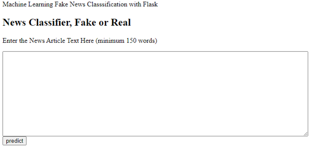
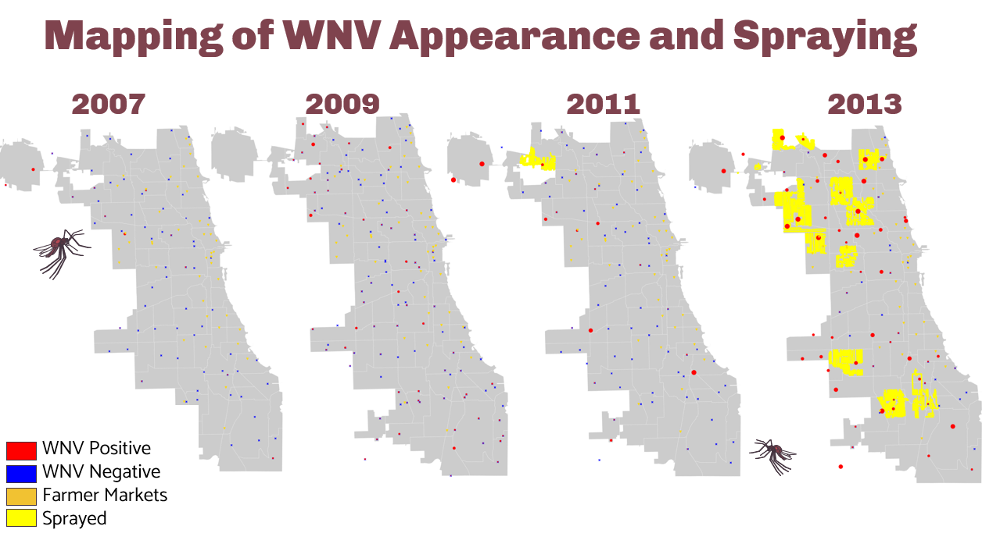
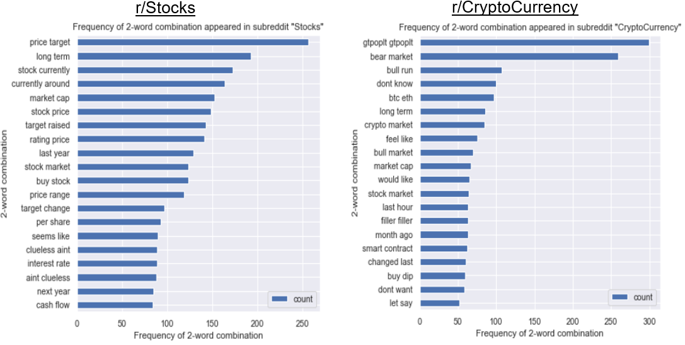

# Portfolio

Hello! I am Andrew, and I am aspiring to be Data Scientist, after working as a Data Analyst in a semiconductor firm. This is a summary of various projects I have worked on. More specific technical details are in their respective githubs (links included). If you are interested to know more, feel free to [get in touch](mailto:chiayj95@hotmail.com), or check out my [Resume](../master/Resume_Chia%20Yih%20Jeng.pdf) or [LinkedIn](https://www.linkedin.com/in/andrewchiayj/). Thank you! 

### Contents

1. [Data Science Projects](#Data-Science-Projects)
    - [Fake News Classification](#-1.-Fake-News-Classification-(General-Assembly-Course))
    - [West Nile Virus Prediction](#-2.-West-Nile-Virus-Prediction-(General-Assembly-Course))
    - [Subreddit Post Classification](#-3.-Subreddit-Post-Classification-(General-Assembly-Course))

## Data Science Projects

### 1. Fake News Classification (General Assembly Course)

*Sep 2021 | https://github.com/AndrewChiaYJ/Fake-News-Classification*

In this project, I have looked into fake news, in particular in US. Fake news, as a word, became a buzzword in 2016 US Presidential Election. It's definition is that false or misleading information presented as news. The purpose of fake news is to damage the reputation of a person or entity, or making money through advertising revenue. Fake News is dangerous to the economy if not dealt with properly and swiftly. According to a report published by  [CHEC](https://s3.amazonaws.com/media.mediapost.com/uploads/EconomicCostOfFakeNews.pdf)  in the year 2019, it was estimated that the global economic cost of fake news to be $78 billion per year which includes direct and indirect cost incurred in the following areas: stock markets, media, reputation management, election campaigns, financial information and healthcare.

This project uses NLP techniques to clean (remove punctuations, remove stop words, tokenize), lemmatize, and vectorize the words (count vectorization, TF-IDF Vectorization) in news articles published near the 2016 US Presidential Election time period. After that, the vectorized data are being processed by multiple machine learning classification models. This is to train the models, and so as to be able to predict if a certain news article is either real or fake.

The final production model (XGBoost with Count Vectorization data) is able to classify the fake news with a high accuracy of 97%, and with a high F1 score (balance between precision and recall) of 98%. 

With this high accuracy model, a simple flask website is built, as shown in the image above. Users are able to use this website to fact check on the news articles that they read, and to be more aware that the issue of fake news is prevalent. 

Further expansions to include more news articles from various areas (healthcare, sports, entertainment), or from different countries (Singapore, Malaysia, Indonesia, UK, etc.) are possible.

#### Language

Python

#### Key Libraries

`numpy` `pandas` `matplotlib` `seaborn` `requests` `regex` `nltk` `tensorflow` `scikit-learn` `CountVectorizer` `TfidfVectorizer` `Pipeline` `LogisticRegression` `BernoulliNB` `MultinomialNB` `RandomForestClassifier` `AdaBoostClassifier` `GradientBoostingClassifier` `XGBClassifier` `SVC` `BertTokenizer ` `BERTModel` `Flask` 

### 2. West Nile Virus Prediction (General Assembly Course)

*Aug 2021 | https://github.com/AndrewChiaYJ/West-Nile-Virus-Prediction*

West Nile virus (WNV) is a single-stranded RNA virus that causes West Nile fever. In Chicago, this virus was detected for the first time in 2002, and 225 human cases were reported that year. In view of presence of this virus, Chicago Department of Public Health (CDPH) has set up a surveillance and control system to trap mosquitos and test for the presence of WNV. This project aims to use these surveillance data to predict the places in Chicago where the West Nile Virus is present, and hence to enable a more accurate and effective plan in deploying pesticides spraying throughout the state. 

Using Gradient Boosting (best performing model out of all models tried), it gave a relatively high ROC AUC of 0.82, as well as F1 Score of 34%.  With this model, it is found that the current (2013) spraying initiative is not effective, as some sprayed areas do not have presence of West Nile Virus, and some areas with serious presence of West Nile Virus are not sprayed. This is shown in the figure above. Therefore, the spraying efforts should be concentrated in areas with presence of West Nile Virus.

After conducting a cost-benefit analysis, we found that the benefit obtained by spraying (cost per WNV infection and overall well being of the city) outweigh the cost of spraying. Hence, it is concluded that spraying is necessary. 

#### Language

Python

#### Key Libraries

`numpy` `pandas` `matplotlib` `seaborn` `scikit-learn` `RandomForestClassifier` `AdaBoostClassifier` `GradientBoostingClassifier` `SVC` 

### 3. Subreddit Post Classification (General Assembly Course)

*Aug 2021 | https://github.com/AndrewChiaYJ/Subreddit-classification*

In this project, I attempted to classify posts from two subreddits -  [r/Stocks](https://www.reddit.com/r/stocks/)  and  [r/CryptoCurrency](https://www.reddit.com/r/cryptocurrency/).  The goal of this project is to apply machine learning techniques to curate and flag irrelevant content posts within each subreddit so as to improve the quality of users’ experience and grow the active user base for better advertising revenue potential. In classifying the posts, we also want to mitigate the risk of losing users to inappropriate removal of posts when they are actually relevant to the thread.

I developed a word-frequency based classification model to predict the subreddit that a random post belongs to. The words of subreddit posts were processed by multiple NLP techniques, and being vectorized into data ( Count Vectorization and TF-IDF Vectorization). Then, a variety of models were tested and evaluated based on prediction accuracy, i.e. how many posts they were able to correctly classify, and prediction sensitivity, i.e. how many  post that is correctly classified within each subreddit. The final production model was a Logistic Regression classifier that makes predictions based on title content and post lengths being vectorized using the TF-IDF method, with an accuracy of 96.1%, and sensitivity of 97.3%. 

To further improve model accuracy and ability to predict on future data, data samples from the subreddits can be collected across a longer time period.  With this model, it is possible to train and further optimise it for production across more subreddit communities. 

#### Language

Python

#### Key Libraries

`numpy` `pandas` `matplotlib` `seaborn` `requests` `regex` `nltk` `scikit-learn` `CountVectorizer` `TfidfVectorizer` `Logistic Regression` `BernoulliNB` `MultinomialNB` `GaussianNB`

### 4. Ames Housing Price Prediction (General Assembly Course)

*Jul 2021 | https://github.com/AndrewChiaYJ/Ames-Housing-Price-Prediction*

In this project, I have examined a comprehensive housing dataset from the city of Ames in Iowa, USA ([source](https://www.kaggle.com/c/dsi-us-6-project-2-regression-challenge/overview)). The goal of this project is to identify areas contributing to high transacted prices and volume of Houses in Ames, so as to help realtors to gain competitive advantage in the Ames Housing Market.

After tested 3 different regression models using a variety of feature engineering techniques, a Ridge Model had the best predictive performance (with R2 of 0.82) on housing sale price in Ames USA. The model revealed top 10 features that will positively impact and top 10 features that will negatively impact housing price in Ames, as shown in the figure above.

It was found that the location of the House matters. Houses in Northridge Height and Northridge would have a high price, whereas houses near neighborhood of Edwards, North Ames, and Old Town would have lower price. Furthermore, quality of house, especially the overall, exterior and kitchen quality, have positive impact to housing prices. The exterior materials of house will also impact the house pricing. Do avoid using HdBoard which has a poor moisture resisting property and require periodic inspection and maintenance. Do also avoid using Stucco as there is a wooden frame underneath and hence, it does not do well in wet climates with high snowfall. Other than above factors, the square footage of house also matters. Houses with 1st floor square footage of around 800-1200 are most commonly sold, as well as houses with Garage square footage of ~500. 

The model may however have limited applicability. This dataset is limited, as it is lacking in some data. It would be good if demographic of neighborhood and buyers are included (age range, marital status, family size,  number of kids) so as to allow a more accurate analysis. Besides, sale price may need to take into account of inflation, and a real value of sale price could be calculated to further modified the model to become more accurate. Nevertheless, there will never be a perfect model; the aim of this model is therefore not to give a perfect prediction, but act as a guideline to inform decisions.

#### Language

Python

#### Key Libraries

`numpy` `pandas` `matplotlib` `seaborn` `scikit-learn` `LinearRegression` `Lasso` `Ridge`

